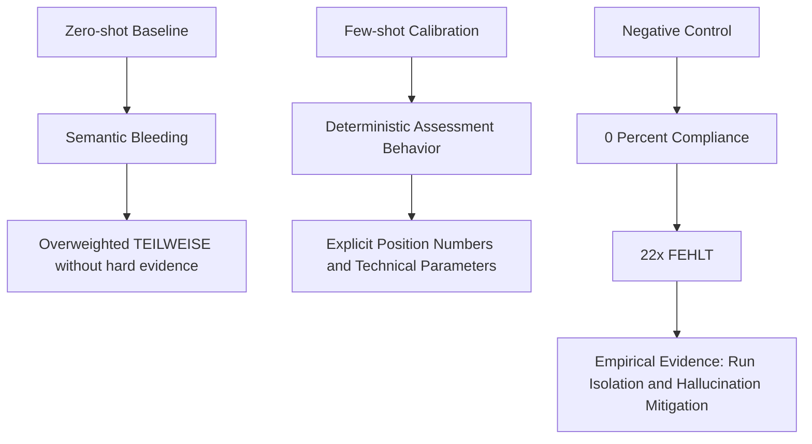
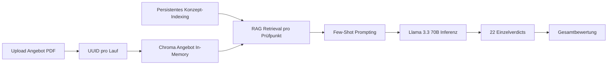
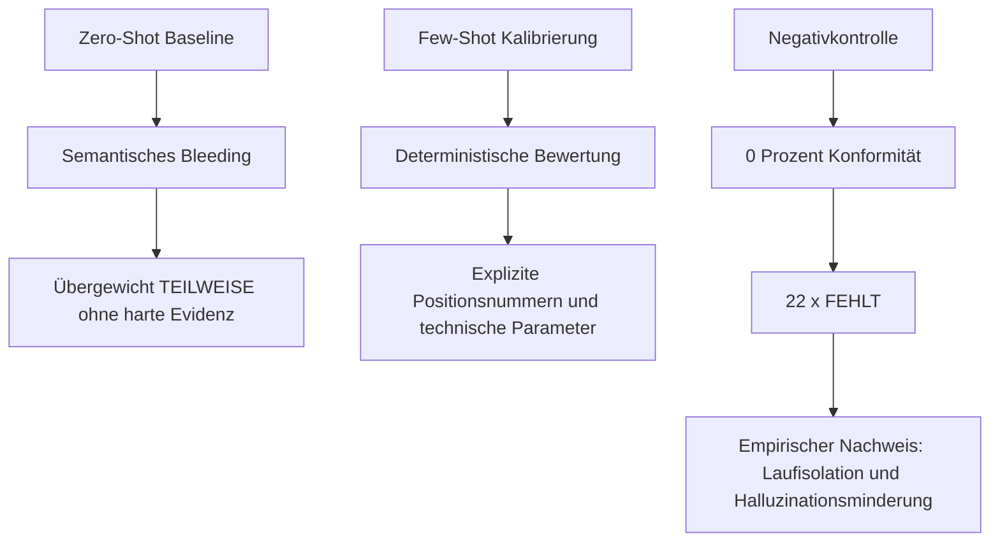

# Angebotsabgleich – Löschanlagenkonzept

**LLM-gestützte Kompatibilitätsprüfung mittels Retrieval-Augmented Generation (RAG)**

- *Leuphana Universität Lüneburg*
- *Modul: KI-unterstützte Produktentwicklung*
- *Dozent: Prof. Dr.-Ing. Arthur Seibel*

---

> **Jump to:** [English Version](#english-version) | [Deutsche Version](#deutsche-version)

---

# English Version

## 1. Problem Statement (Research Question)

> You are a logistics company planning the construction of a new hazardous materials warehouse.
> An engineering firm has produced a **fire suppression system specification** (*Löschanlagenkonzept*) for you.
> To implement this specification, a service provider submits a **component list** (*Komponentenliste*) as their offer.
> Develop an LLM-based solution that automatically verifies the compatibility of the component list with the fire suppression system specification:
> **Can the fire suppression system specification be fully implemented using the offered component list?**

### 1.1 Research Question

**How can a Large Language Model (LLM), combined with Retrieval-Augmented Generation (RAG), be used to automatically assess whether a vendor's component list fully satisfies all technical requirements defined in a fire suppression system specification — and identify any gaps with traceable, evidence-based reasoning?**

### 1.2 Scope and Constraints

- The specification document (*Löschanlagenkonzept*) serves as the normative reference (ground truth).
- The component list (*Komponentenliste*) serves as the candidate document to be verified.
- Both documents are provided as PDF files in German.
- The system must produce structured, per-requirement verdicts (ERFÜLLT / TEILWEISE / FEHLT) with justifications referencing specific document passages.
- The solution must be reproducible, deterministic (temperature = 0), and executable as both a CLI tool and a web application.

---

## 2. Methodology

The solution follows a five-phase approach grounded in the Retrieval-Augmented Generation (RAG) paradigm. Each phase is described below in the order it was developed and executed.

### Phase 1: Domain Analysis and Requirement Decomposition

Before any code was written, the fire suppression system specification was manually analysed to extract 22 discrete, verifiable requirements. These requirements were organised into seven thematic categories:

| Category | Check IDs | Count | Description |
|---|---|---|---|
| Sprinkler systems (Compartment 1) | SPR-1 to SPR-3 | 3 | Ceiling protection, rack protection, pre-zone protection |
| Sprinkler systems (ancillary rooms) | SPR-4 | 1 | Office, social, and technical areas |
| Sprinkler monitoring | SPR-5 | 1 | Valve monitoring, pressure switches, alarm devices |
| CO₂ low-pressure extinguishing | CO2-1 to CO2-6 | 6 | Three extinguishing zones, CO₂ tank, nozzle network, pressure relief |
| Fire detection and alarming | DET-1 to DET-3 | 3 | Aspirating smoke detectors, UV flame detectors, two-detector dependency |
| Alarm systems | ALM-1 to ALM-3 | 3 | Acoustic/optical alarms, warning panels, alarm forwarding to fire alarm centre |
| Control centre and utilities | CTR-1 to CTR-2 | 2 | Extinguishing control centre with 30 h battery backup, equipment shutdowns |
| Water supply and hydrants | WTR-1 to WTR-2 | 2 | Pump station (600 m³), indoor/outdoor hydrants |
| Quality and commissioning | QST-1 | 1 | VdS certification, accredited installer |

Each requirement was formalised as a structured check point with:
- A unique identifier (e.g. `SPR-1`, `CO2-3`)
- A human-readable title summarising the technical requirement
- A **specification query** (`konzept_query`): keywords for retrieving relevant passages from the specification
- An **offer query** (`angebot_query`): keywords for retrieving relevant passages from the component list

This manual decomposition step is critical because it translates domain-specific fire protection engineering knowledge into structured retrieval queries, ensuring that the RAG system targets precisely the right document sections for each compliance check.

### Phase 2: Document Ingestion and Vector Store Construction

Both PDF documents are processed through an identical pipeline:

1. **PDF loading**: Each PDF is loaded using `PyPDFLoader` (from `langchain_community`), which extracts text content page by page while preserving metadata (page numbers).

2. **Text chunking**: The extracted text is split into overlapping chunks using `RecursiveCharacterTextSplitter` with:
   - `chunk_size = 1000` characters
   - `chunk_overlap = 200` characters

   The overlap ensures that information spanning chunk boundaries is not lost. The chunk size was chosen to balance retrieval precision (smaller chunks are more focused) against context completeness (larger chunks provide more surrounding information).

3. **Embedding**: Each chunk is embedded into a dense vector representation using the **multilingual-e5-large-instruct** model, accessed via the GWDG SAIA API (`https://chat-ai.academiccloud.de/v1/embeddings`). This model was selected because:
   - It supports German text natively with strong multilingual performance
   - It is available through the GWDG academic infrastructure with generous rate limits
   - It produces high-dimensional embeddings suitable for semantic similarity search

4. **Vector store strategy and isolation**: The embedded chunks are stored in **ChromaDB** with a split strategy:
   - `.chroma_konzept/` — persisted index for the specification document (reused across runs)
   - `angebot_<UUID>` — ephemeral in-memory collection for each uploaded offer document

   For each run, the component list index is created with a unique UUID-based collection name. This enforces strict session isolation and prevents cross-contamination between experiments and test runs.

### Phase 3: Retrieval-Augmented Compatibility Checking

For each of the 22 check points, the system performs the following steps:

1. **Context retrieval**: Two similarity searches are executed against the respective vector stores:
   - The `konzept_query` retrieves the top-5 most relevant chunks from the specification index
   - The `angebot_query` retrieves the top-5 most relevant chunks from the component list index

2. **Prompt construction**: The retrieved contexts are injected into a structured prompt template that instructs the LLM to act as a fire protection engineer (*Brandschutzfachplaner*). The prompt includes:
   - The category and title of the current check point
   - The retrieved specification passages (as normative reference)
   - The retrieved component list passages (as evidence for/against compliance)
   - Domain-specific **few-shot examples** (sprinkler systems, CO₂ extinguishing, aspirating smoke detection)
   - Explicit output format instructions requiring a structured response with concrete references (e.g. position numbers)

3. **LLM inference**: The assembled prompt is sent to **Llama 3.3 70B Instruct** via the GWDG SAIA API (`/v1/chat/completions`). The model is configured with `temperature = 0` to ensure deterministic, reproducible outputs.

4. **Response parsing**: The raw LLM output is parsed to extract three fields:
   - `VERDICT`: One of ERFÜLLT (fulfilled), TEILWEISE (partially fulfilled), or FEHLT (missing)
   - `BEGRÜNDUNG`: A 1–3 sentence justification with specific position numbers or text references
   - `LÜCKEN`: Concrete identification of what is missing (if TEILWEISE or FEHLT)

### Phase 4: Summary Generation

After all 22 individual checks are completed, a second LLM call generates a holistic assessment:

- All individual results are concatenated into a summary input
- The LLM is prompted (again as a fire protection engineer) to produce a max-200-word German-language overall assessment answering:
  1. Can the specification be fully implemented with the component list?
  2. What are the critical gaps (if any)?
  3. What are the recommended next steps?
- The response begins with one of: VOLLSTÄNDIG UMSETZBAR / BEDINGT UMSETZBAR / NICHT VOLLSTÄNDIG UMSETZBAR

### Phase 5: Performance Optimisation

The initial implementation suffered from significant latency due to:
- **Sequential execution**: All 22 checks ran one after another
- **Mandatory sleep delays**: 2-second pauses between API calls to avoid rate limits
- **Slow retry backoff**: 15-second initial retry delay on rate-limit errors

The following optimisations were applied:

| Aspect | Before | After |
|---|---|---|
| API provider | Google Gemini (free tier, 15 RPM) | GWDG SAIA (30 RPM, academic infrastructure) |
| LLM model | `gemini-3-flash-preview` | `llama-3.3-70b-instruct` (70B parameters) |
| Embedding model | `gemini-embedding-001` | `multilingual-e5-large-instruct` |
| Execution mode | Sequential (1 check at a time) | Concurrent (5 parallel workers via `ThreadPoolExecutor`) |
| Inter-call sleep | 2 seconds (mandatory) | 0 seconds (rate limits handled by retry logic) |
| Retry initial delay | 15 seconds | 5 seconds |
| Estimated total time | ~3–5 minutes | ~30–60 seconds |

The switch to concurrent execution alone reduces wall-clock time by approximately 4–5×, while the elimination of mandatory sleep delays and the use of a higher-throughput API endpoint contribute additional speedup.

---

## 3. System Architecture

### 3.1 Architecture and Feature Upgrades

- **Dynamic file upload (offer PDF)**: The Streamlit UI now accepts arbitrary component-list PDFs at runtime, enabling flexible scenario-based testing without replacing project-root files.
- **In-memory vector database isolation**: Each upload is processed in an isolated UUID-scoped Chroma collection, ensuring methodological separation between runs.
- **Few-shot prompting instead of zero-shot baseline**: The compliance prompt was recalibrated with domain-specific exemplars (sprinkler, CO₂ systems, aspirating smoke detectors) to improve determinism and reduce semantic over-generalization.

```
┌─────────────────────────────────────────────────────────────────┐
│                        User Interface                           │
│              app.py (Streamlit) or CLI (compare_rag.py)         │
└─────────────┬───────────────────────────────────┬───────────────┘
              │                                   │
              ▼                                   ▼
┌──────────────────────┐           ┌──────────────────────────────┐
│   PDF Ingestion       │           │   Compatibility Engine        │
│                       │           │                              │
│ ┌──────────────────┐  │           │  For each of 22 checks:      │
│ │ PyPDFLoader       │  │           │  1. Retrieve from Konzept DB │
│ │ (page-by-page)    │  │           │  2. Retrieve from Angebot DB │
│ └────────┬─────────┘  │           │  3. Construct prompt         │
│          ▼             │           │  4. Call LLM (GWDG SAIA)    │
│ ┌──────────────────┐  │           │  5. Parse VERDICT            │
│ │ Text Splitter     │  │           │                              │
│ │ (1000 chars,      │  │           │  ThreadPoolExecutor          │
│ │  200 overlap)     │  │           │  (5 concurrent workers)      │
│ └────────┬─────────┘  │           └──────────────┬───────────────┘
│          ▼             │                          │
│ ┌──────────────────┐  │                          ▼
│ │ Embedding API     │  │           ┌──────────────────────────────┐
│ │ (multilingual-    │  │           │   Summary Generation          │
│ │  e5-large)        │  │           │   (Llama 3.3 70B)            │
│ └────────┬─────────┘  │           │   → Overall verdict           │
│          ▼             │           │   → Critical gaps             │
│ ┌──────────────────┐  │           │   → Next steps                │
│ │ ChromaDB          │  │           └──────────────┬───────────────┘
│ │ (persisted)       │  │                          │
│ └──────────────────┘  │                          ▼
└───────────────────────┘           ┌──────────────────────────────┐
                                    │   Report Output               │
                                    │   (.txt file + UI display)    │
                                    └──────────────────────────────┘
```

---

## 4. Technology Stack

| Component | Technology | Rationale |
|---|---|---|
| Language | Python 3.11+ | Modern type hints, async support, broad ML ecosystem |
| Package manager | `uv` | Fast, deterministic dependency resolution |
| LLM orchestration | LangChain (LCEL) | Composable chains, prompt templates, output parsers |
| Vector database | ChromaDB (persisted to disk) | Lightweight, embeddable, no external server required |
| Embedding model | `multilingual-e5-large-instruct` (GWDG SAIA) | Strong German-language performance, academic access |
| LLM | `llama-3.3-70b-instruct` (GWDG SAIA) | 70B parameter model, instruction-tuned, high accuracy |
| API provider | GWDG SAIA (Scalable AI Accelerator) | OpenAI-compatible API, academic infrastructure, 30 RPM |
| Web UI | Streamlit | Rapid prototyping, built-in widgets, real-time progress |
| PDF parsing | PyPDF (via LangChain) | Reliable text extraction from PDF documents |

---

## 5. Project Structure

```
G1KI_Angebotsabgleich/
├── app.py                     # Streamlit web UI
├── compare_rag.py             # RAG core module (compatibility engine + CLI)
├── main.py                    # Entry point stub
├── Loeschanlagenkonzept.pdf   # Fire suppression specification (input)
├── TestDaten_Angebot/         # Demo and test offers (e.g. Komponentenliste.pdf)
├── abgleich_ergebnis.txt      # Generated compatibility report (output)
├── .chroma_konzept/           # Persisted vector store – specification index
├── abgleich_llama_3_3_70b_instruct.txt  # Model-specific report output (CLI)
├── pyproject.toml             # Project metadata and dependencies
├── uv.lock                    # Locked dependency versions
├── LICENSE                    # Project licence
├── README.md                  # This file
└── .venv/                     # Virtual environment (managed by uv)
```

---

## 6. Compatibility Check Points (22 Total)

| ID | Category | Check Point (Summary) |
|---|---|---|
| SPR-1 | Sprinkler – Compartment 1 | Ceiling protection (7.5 mm/min, RTI 50–80, 68 °C) |
| SPR-2 | Sprinkler – Compartment 1 | Rack protection (10.0 mm/min, RTI ≤ 50, 7 levels) |
| SPR-3 | Sprinkler – Compartment 1 | Pre-zone protection axis I-J'/27-33 |
| SPR-4 | Sprinkler – Ancillary rooms | Office, social, and technical areas |
| SPR-5 | Sprinkler – Monitoring | Valve monitoring, pressure switches, alarm devices |
| CO2-1 | CO₂ extinguishing system | Zone 1 – Compartment 2 (3,070 kg, 3 nozzle levels) |
| CO2-2 | CO₂ extinguishing system | Zone 2 – Compartment 3 (18,515 kg, 3 nozzle levels) |
| CO2-3 | CO₂ extinguishing system | Zone 3 – Picking area (14,024 kg, 2 levels) |
| CO2-4 | CO₂ extinguishing system | CO₂ storage tank (min. 30,000 kg) |
| CO2-5 | CO₂ extinguishing system | Nozzle network DN 25–80 across all zones |
| CO2-6 | CO₂ extinguishing system | Pneumatic pressure relief flaps (200 Pa) |
| DET-1 | Fire detection | Aspirating smoke detectors (VdS-approved) |
| DET-2 | Fire detection | UV flame detectors |
| DET-3 | Fire detection | Two-detector/two-line dependency + manual release (DKM) |
| ALM-1 | Alarm systems | Flash lights, horns, sirens |
| ALM-2 | Alarm systems | Warning panels / illuminated signs |
| ALM-3 | Alarm systems | Alarm forwarding to fire alarm centre (BMZ) |
| CTR-1 | Control centre | Extinguishing control unit + 30 h battery backup |
| CTR-2 | Equipment shutdowns | HVAC, fire dampers, doors/gates |
| WTR-1 | Water supply | Pump station / existing system (600 m³) |
| WTR-2 | Hydrants | Indoor/outdoor hydrants (1,600 l/min, 60 min) |
| QST-1 | Quality & commissioning | VdS certification, accredited installer |

---

## 7. Installation and Usage

### 7.1 Prerequisites

- **Python 3.11+**
- **uv** package manager
- **Docker** + **Docker Compose** (optional container runtime)

```bash
python3 --version   # must be ≥ 3.11
uv --version        # install via: curl -Ls https://astral.sh/uv/install.sh | sh
docker --version
docker compose version
```

### 7.2 Setup

```bash
# Clone or navigate to the project directory
cd G1KI_Angebotsabgleich

# Create virtual environment and install all dependencies
uv venv
uv sync
```

### 7.3 Place Input Documents

Required in project root:

| Filename | Contents |
|---|---|
| `Loeschanlagenkonzept.pdf` | Fire suppression specification (normative reference) |

Offer document options:
- **Web UI**: upload any offer PDF dynamically during runtime.
- **CLI**: pass the offer path as a command-line argument.
- A demo file is provided in `TestDaten_Angebot/Komponentenliste.pdf`.

### 7.4 Run the Streamlit Web Application

```bash
uv run streamlit run app.py
```

The application opens at `http://localhost:8501`. Use the **▶ Abgleich starten** button to run the compatibility check.
For a quick demonstration, upload `TestDaten_Angebot/Komponentenliste.pdf` in the UI.

### 7.5 Run via Command Line (CLI)

```bash
uv run python compare_rag.py TestDaten_Angebot/Komponentenliste.pdf
# alternativ / alternatively
python compare_rag.py TestDaten_Angebot/Komponentenliste.pdf
```

Results are printed to the terminal and saved as a model-specific report file.

### 7.6 Run with Docker (Alternative)

The repository already contains a production-ready `Dockerfile` and `docker-compose.yml`.

1. Create a `.env` file in the project root (required by `docker-compose.yml`):

```bash
cat > .env << 'EOF'
GWDG_API_KEY=your_api_key_here
EOF
```

2. Build and start the container:

```bash
docker compose up --build
```

3. Open the app:

- `http://localhost:8501`

4. Stop the service:

```bash
docker compose down
```

### 7.7 Interpreting Results

Each check point receives one of three verdicts:

| Verdict | Icon | Meaning |
|---|---|---|
| ERFÜLLT | ✅ | The component list fully covers this requirement |
| TEILWEISE | ⚠️ | The requirement is partially covered; specific gaps are identified |
| FEHLT | ❌ | The requirement is entirely absent from the component list |

The final summary classifies the overall compatibility as:
- **VOLLSTÄNDIG UMSETZBAR** — All requirements can be implemented with the offered components
- **BEDINGT UMSETZBAR** — Most requirements are covered, but gaps exist
- **NICHT VOLLSTÄNDIG UMSETZBAR** — Critical requirements are missing

---

## 8. Configuration

All configurable parameters are defined at the top of `compare_rag.py`:

```python
GWDG_API_KEY    = "..."                              # GWDG SAIA API key
GWDG_BASE_URL   = "https://chat-ai.academiccloud.de/v1"
MODEL           = "llama-3.3-70b-instruct"           # LLM for compliance checks
EMBEDDING_MODEL = "multilingual-e5-large-instruct"   # Embedding model
MAX_WORKERS     = 5                                  # Concurrent LLM calls
KONZEPT_PDF     = "Loeschanlagenkonzept.pdf"
ANGEBOT_PDF     = "Komponentenliste.pdf"
```

### Forcing a Vector Store Rebuild

If the specification PDF is replaced with a new version, delete the cached concept index so it is rebuilt on the next run:

```bash
rm -rf .chroma_konzept
```

The offer index is created in-memory per run (UUID-scoped) and therefore does not require manual cache cleanup.

---

## 9. Troubleshooting

| Problem | Cause | Solution |
|---|---|---|
| `429 Too Many Requests` | API rate limit exceeded | Built-in retry with exponential backoff handles this automatically. If persistent, reduce `MAX_WORKERS` to 3. |
| Import errors in VS Code | Pylance using wrong Python | `Ctrl+Shift+P` → **Python: Select Interpreter** → `.venv/bin/python` |
| `PDF nicht gefunden` | Missing required files or wrong CLI path | Ensure `Loeschanlagenkonzept.pdf` is in the project root and the offer path is valid (UI upload or CLI argument). |
| Stale results after specification PDF update | Old concept vector index cached | Run `rm -rf .chroma_konzept` |

---

## 10. API Access

This project uses the **GWDG SAIA** (Scalable AI Accelerator) API, which is OpenAI-compatible and available to members of German academic institutions.

- **Endpoint**: `https://chat-ai.academiccloud.de/v1`
- **Documentation**: [https://docs.hpc.gwdg.de/services/saia/index.html](https://docs.hpc.gwdg.de/services/saia/index.html)
- **Rate limits**: 30 requests/minute, 200/hour, 1000/day (per API key)
- **Available models**: [https://docs.hpc.gwdg.de/chat-ai/models](https://docs.hpc.gwdg.de/chat-ai/models)

---

## 11. Limitations and Future Work

1. **Static check point catalogue**: The 22 check points are manually defined. Future work could explore automatic requirement extraction from the specification document using LLM-based information extraction.
2. **Single-document scope**: The system currently compares exactly two documents. Extending it to handle multiple specification documents or multiple offers simultaneously would increase practical applicability.
3. **No fine-tuning**: The LLM currently uses domain-specific few-shot prompting without parameter-level adaptation. Domain-specific fine-tuning on fire protection compliance data could further improve robustness.
4. **PDF quality dependency**: The system relies on text-extractable PDFs. Scanned documents would require an OCR preprocessing step.
5. **Verdict granularity**: The three-level verdict scale (ERFÜLLT / TEILWEISE / FEHLT) could be refined into a numerical compliance score for quantitative analysis.

---

## 12. Evaluation & Scientific Results

### 12.1 Zero-Shot vs. Few-Shot Calibration

Early experiments with the initial zero-shot baseline exhibited pronounced **semantic bleeding**: the model tended to produce *TEILWEISE* verdicts when generic fire-safety vocabulary was present, even in the absence of hard evidence at the level of concrete item references. After migrating to domain-specific few-shot prompting (sprinkler systems, CO2 extinguishing systems, aspirating smoke detectors), decision behavior became substantially more calibrated. The model now behaves in a deterministic and traceable manner, consistently requiring explicit position numbers and technical parameters as evidential support for partial or full compliance.

### 12.2 Negative Control Test

To stress-test pipeline reliability, we deliberately uploaded a thematically unrelated document (a tutorial on digital networks) as the offer input. The system correctly returned a compliance rate of **0%** (22x *FEHLT*) and explicitly identified the topic mismatch in its reasoning output. Empirically, this result demonstrates that the RAG pipeline is fully run-isolated through UUID-based in-memory indexing and that parametric hallucinations in the form of domain-inappropriate pseudo-compliance are effectively mitigated.

### 12.3 Visual Summary




---
---

# Deutsche Version

## 1. Aufgabenstellung (Problemstellung)

> Sie sind ein Logistikunternehmen und planen den Neubau eines Gefahrstofflagers.
> Dafür haben Sie von einem Ingenieurbüro ein **Löschanlagenkonzept** erstellen
> lassen. Zur Umsetzung dieses Konzepts erhalten Sie von einem Dienstleister als
> Angebot eine **Komponentenliste**.
> Erstellen Sie eine LLM-basierte Lösung, mit der automatisch die Kompatibilität
> der Komponentenliste mit dem Löschanlagenkonzept überprüft wird: Ist mit der
> Komponentenliste das Löschanlagenkonzept vollständig umsetzbar?

### 1.1 Forschungsfrage

**Wie kann ein Large Language Model (LLM) in Kombination mit Retrieval-Augmented Generation (RAG) eingesetzt werden, um automatisiert zu prüfen, ob eine Komponentenliste eines Anbieters alle technischen Anforderungen eines Löschanlagenkonzepts vollständig erfüllt — und dabei etwaige Lücken mit nachvollziehbarer, beleggestützter Begründung identifiziert?**

### 1.2 Umfang und Rahmenbedingungen

- Das Löschanlagenkonzept dient als normative Referenz (Soll-Zustand).
- Die Komponentenliste dient als zu prüfendes Kandidatendokument (Ist-Zustand).
- Beide Dokumente liegen als deutschsprachige PDF-Dateien vor.
- Das System muss strukturierte Einzelbewertungen pro Anforderung liefern (ERFÜLLT / TEILWEISE / FEHLT) mit Begründungen, die auf konkrete Dokumentpassagen verweisen.
- Die Lösung muss reproduzierbar, deterministisch (Temperatur = 0) und sowohl als CLI-Werkzeug als auch als Webanwendung ausführbar sein.

---

## 2. Methodik

Die Lösung folgt einem fünfphasigen Ansatz, der auf dem Paradigma der Retrieval-Augmented Generation (RAG) basiert. Jede Phase wird nachfolgend in der Reihenfolge ihrer Entwicklung und Durchführung beschrieben.

### Phase 1: Domänenanalyse und Anforderungszerlegung

Vor jeder Programmierung wurde das Löschanlagenkonzept manuell analysiert, um 22 diskrete, überprüfbare Anforderungen zu extrahieren. Diese Anforderungen wurden in sieben thematische Kategorien gegliedert:

| Kategorie | Prüfpunkt-IDs | Anzahl | Beschreibung |
|---|---|---|---|
| Sprinkleranlagen (Compartment 1) | SPR-1 bis SPR-3 | 3 | Deckenschutz, Regalschutz, Vorzonenschutz |
| Sprinkleranlagen (Nebenräume) | SPR-4 | 1 | Büro-, Sozial- und Technikbereiche |
| Sprinklerüberwachung | SPR-5 | 1 | Schieberüberwachung, Druckschalter, Alarmgebung |
| CO₂-Niederdruck-Löschanlage | CO2-1 bis CO2-6 | 6 | Drei Löschbereiche, CO₂-Tank, Düsennetz, Druckentlastung |
| Branderkennung und Alarmierung | DET-1 bis DET-3 | 3 | Ansaugrauchmelder, UV-Flammenmelder, 2-Melder-Abhängigkeit |
| Alarmierungssysteme | ALM-1 bis ALM-3 | 3 | Akustische/optische Alarmierung, Warntableaus, Alarmweiterleitung an BMZ |
| Steuerzentrale und Betriebsmittel | CTR-1 bis CTR-2 | 2 | Löschsteuerzentrale mit 30-h-Akku-Pufferung, Betriebsmittelabschaltungen |
| Wasserversorgung und Hydranten | WTR-1 bis WTR-2 | 2 | Pumpenzentrale (600 m³), Innen-/Außenhydranten |
| Qualität und Inbetriebnahme | QST-1 | 1 | VdS-Zulassung, anerkannter Errichter |

Jede Anforderung wurde als strukturierter Prüfpunkt formalisiert mit:
- Einer eindeutigen Kennung (z. B. `SPR-1`, `CO2-3`)
- Einem lesbaren Titel, der die technische Anforderung zusammenfasst
- Einer **Konzept-Suchanfrage** (`konzept_query`): Schlüsselwörter zur Abrufung relevanter Passagen aus dem Konzept
- Einer **Angebots-Suchanfrage** (`angebot_query`): Schlüsselwörter zur Abrufung relevanter Passagen aus der Komponentenliste

Dieser manuelle Zerlegungsschritt ist entscheidend, da er domänenspezifisches Brandschutz-Fachwissen in strukturierte Suchanfragen übersetzt und somit sicherstellt, dass das RAG-System für jede Konformitätsprüfung exakt die richtigen Dokumentabschnitte ansteuert.

### Phase 2: Dokumentenaufnahme und Aufbau der Vektordatenbanken

Beide PDF-Dokumente durchlaufen eine identische Verarbeitungspipeline:

1. **PDF-Laden**: Jedes PDF wird mittels `PyPDFLoader` (aus `langchain_community`) geladen, wobei der Textinhalt seitenweise extrahiert und Metadaten (Seitenzahlen) erhalten bleiben.

2. **Text-Chunking**: Der extrahierte Text wird in überlappende Abschnitte aufgeteilt mittels `RecursiveCharacterTextSplitter` mit:
   - `chunk_size = 1000` Zeichen
   - `chunk_overlap = 200` Zeichen

   Die Überlappung stellt sicher, dass Informationen an Chunk-Grenzen nicht verloren gehen. Die Chunk-Größe wurde gewählt, um Abrufpräzision (kleinere Chunks sind fokussierter) gegen Kontextvollständigkeit (größere Chunks liefern mehr Umgebungsinformation) abzuwägen.

3. **Embedding**: Jeder Chunk wird in eine dichte Vektordarstellung überführt mittels des Modells **multilingual-e5-large-instruct**, zugänglich über die GWDG SAIA API (`https://chat-ai.academiccloud.de/v1/embeddings`). Dieses Modell wurde gewählt, weil:
   - Es deutschsprachigen Text nativ mit starker multilingualer Performanz unterstützt
   - Es über die akademische Infrastruktur der GWDG mit großzügigen Rate-Limits verfügbar ist
   - Es hochdimensionale Embeddings erzeugt, die für semantische Ähnlichkeitssuche geeignet sind

4. **Vektordatenbank-Strategie und Isolation**: Die eingebetteten Chunks werden in **ChromaDB** mit getrennter Persistenzstrategie verwaltet:
   - `.chroma_konzept/` — persistierter Index für das Konzeptdokument (wird laufübergreifend wiederverwendet)
   - `angebot_<UUID>` — flüchtige In-Memory-Collection pro Upload/Lauf für die Komponentenliste

   Für jeden Lauf wird der Angebotsindex mit einer eindeutigen UUID erstellt. Dadurch wird eine strikte Sitzungstrennung erreicht und eine Kreuzkontamination zwischen Testläufen methodisch ausgeschlossen.

### Phase 3: Retrieval-augmentierte Kompatibilitätsprüfung

Für jeden der 22 Prüfpunkte führt das System folgende Schritte aus:

1. **Kontextabruf**: Zwei Ähnlichkeitssuchen werden gegen die jeweiligen Vektordatenbanken ausgeführt:
   - Die `konzept_query` ruft die 5 relevantesten Chunks aus dem Konzept-Index ab
   - Die `angebot_query` ruft die 5 relevantesten Chunks aus dem Komponentenlisten-Index ab

2. **Prompt-Konstruktion**: Die abgerufenen Kontexte werden in ein strukturiertes Prompt-Template injiziert, das das LLM anweist, als Brandschutzfachplaner zu agieren. Der Prompt enthält:
   - Kategorie und Titel des aktuellen Prüfpunkts
   - Die abgerufenen Konzeptpassagen (als normative Referenz)
   - Die abgerufenen Komponentenlistenpassagen (als Belege für/gegen Konformität)
   - Domänenspezifische **Few-Shot-Beispiele** (Sprinkler, CO₂-Anlage, Ansaugrauchmelder)
   - Explizite Ausgabeformatanweisungen, die eine strukturierte Antwort mit konkreten Positionsnummern und Textbelegen erzwingen

3. **LLM-Inferenz**: Der zusammengestellte Prompt wird an **Llama 3.3 70B Instruct** über die GWDG SAIA API (`/v1/chat/completions`) gesendet. Das Modell ist mit `temperature = 0` konfiguriert, um deterministische, reproduzierbare Ausgaben zu gewährleisten.

4. **Antwort-Parsing**: Die rohe LLM-Ausgabe wird geparst, um drei Felder zu extrahieren:
   - `VERDICT`: Eines von ERFÜLLT (erfüllt), TEILWEISE (teilweise erfüllt) oder FEHLT (fehlt)
   - `BEGRÜNDUNG`: Eine 1–3 Sätze umfassende Rechtfertigung mit konkreten Positionsnummern oder Textbelegen
   - `LÜCKEN`: Konkrete Identifikation dessen, was fehlt (bei TEILWEISE oder FEHLT)

### Phase 4: Zusammenfassungsgenerierung

Nach Abschluss aller 22 Einzelprüfungen erzeugt ein zweiter LLM-Aufruf eine ganzheitliche Bewertung:

- Alle Einzelergebnisse werden zu einem Zusammenfassungs-Input konkateniert
- Das LLM wird (erneut als Brandschutzfachplaner) aufgefordert, eine max. 200 Wörter umfassende deutschsprachige Gesamtbewertung zu erstellen, die beantwortet:
  1. Kann das Löschanlagenkonzept mit der Komponentenliste vollständig umgesetzt werden?
  2. Was sind die kritischen Lücken (falls vorhanden)?
  3. Welche nächsten Schritte werden empfohlen?
- Die Antwort beginnt mit einem von: VOLLSTÄNDIG UMSETZBAR / BEDINGT UMSETZBAR / NICHT VOLLSTÄNDIG UMSETZBAR

### Phase 5: Performanzoptimierung

Die ursprüngliche Implementierung litt unter erheblicher Latenz aufgrund von:
- **Sequentieller Ausführung**: Alle 22 Prüfungen liefen nacheinander
- **Zwangspausen**: 2-Sekunden-Pausen zwischen API-Aufrufen zur Vermeidung von Rate-Limits
- **Langsamem Retry-Backoff**: 15 Sekunden initiale Wiederholungsverzögerung bei Rate-Limit-Fehlern

Folgende Optimierungen wurden umgesetzt:

| Aspekt | Vorher | Nachher |
|---|---|---|
| API-Anbieter | Google Gemini (Free Tier, 15 RPM) | GWDG SAIA (30 RPM, akademische Infrastruktur) |
| LLM-Modell | `gemini-3-flash-preview` | `llama-3.3-70b-instruct` (70B Parameter) |
| Embedding-Modell | `gemini-embedding-001` | `multilingual-e5-large-instruct` |
| Ausführungsmodus | Sequentiell (1 Prüfung gleichzeitig) | Parallel (5 gleichzeitige Worker via `ThreadPoolExecutor`) |
| Pause zwischen Aufrufen | 2 Sekunden (obligatorisch) | 0 Sekunden (Rate-Limits durch Retry-Logik behandelt) |
| Retry-Anfangsverzögerung | 15 Sekunden | 5 Sekunden |
| Geschätzte Gesamtdauer | ~3–5 Minuten | ~30–60 Sekunden |

Allein der Wechsel zur parallelen Ausführung reduziert die Wanduhrzeit um ca. 4–5×, während die Eliminierung der Zwangspausen und die Nutzung eines durchsatzstärkeren API-Endpunkts zusätzliche Beschleunigung beitragen.

---

## 3. Systemarchitektur

### 3.1 Architektur- und Feature-Upgrades

- **Dynamischer Datei-Upload**: Die Streamlit-Oberfläche akzeptiert zur Laufzeit beliebige Angebots-PDFs (Komponentenlisten), ohne dass Dateien im Projektstamm ersetzt werden müssen.
- **In-Memory-Vektordatenbank-Isolation**: Jeder Upload wird in einer UUID-basierten, flüchtigen Chroma-Collection verarbeitet; dadurch sind Testläufe strikt voneinander getrennt.
- **Few-Shot statt Zero-Shot**: Die Prompt-Kalibrierung wurde auf domänenspezifische Beispiele (Sprinkler, CO₂-Anlagen, Ansaugrauchmelder) umgestellt, um deterministische und nachvollziehbare Bewertungen zu erzwingen.

```
┌─────────────────────────────────────────────────────────────────┐
│                     Benutzeroberfläche                           │
│              app.py (Streamlit) oder CLI (compare_rag.py)       │
└─────────────┬───────────────────────────────────┬───────────────┘
              │                                   │
              ▼                                   ▼
┌──────────────────────┐           ┌──────────────────────────────┐
│   PDF-Aufnahme        │           │   Kompatibilitäts-Engine      │
│                       │           │                              │
│ ┌──────────────────┐  │           │  Für jeden der 22 Prüfpunkte:│
│ │ PyPDFLoader       │  │           │  1. Abruf aus Konzept-DB     │
│ │ (seitenweise)     │  │           │  2. Abruf aus Angebots-DB    │
│ └────────┬─────────┘  │           │  3. Prompt-Konstruktion       │
│          ▼             │           │  4. LLM-Aufruf (GWDG SAIA)  │
│ ┌──────────────────┐  │           │  5. VERDICT-Parsing           │
│ │ Text-Splitter     │  │           │                              │
│ │ (1000 Zeichen,    │  │           │  ThreadPoolExecutor           │
│ │  200 Überlappung) │  │           │  (5 parallele Worker)        │
│ └────────┬─────────┘  │           └──────────────┬───────────────┘
│          ▼             │                          │
│ ┌──────────────────┐  │                          ▼
│ │ Embedding-API     │  │           ┌──────────────────────────────┐
│ │ (multilingual-    │  │           │   Zusammenfassungsgenerierung │
│ │  e5-large)        │  │           │   (Llama 3.3 70B)            │
│ └────────┬─────────┘  │           │   → Gesamtbewertung           │
│          ▼             │           │   → Kritische Lücken          │
│ ┌──────────────────┐  │           │   → Empfohlene nächste Schritte│
│ │ ChromaDB          │  │           └──────────────┬───────────────┘
│ │ (persistiert)     │  │                          │
│ └──────────────────┘  │                          ▼
└───────────────────────┘           ┌──────────────────────────────┐
                                    │   Berichtsausgabe              │
                                    │   (.txt-Datei + UI-Darstellung)│
                                    └──────────────────────────────┘
```

---

## 4. Technologie-Stack

| Komponente | Technologie | Begründung |
|---|---|---|
| Sprache | Python 3.11+ | Moderne Type Hints, Async-Unterstützung, breites ML-Ökosystem |
| Paketmanager | `uv` | Schnelle, deterministische Abhängigkeitsauflösung |
| LLM-Orchestrierung | LangChain (LCEL) | Komponierbare Ketten, Prompt-Templates, Ausgabe-Parser |
| Vektordatenbank | ChromaDB (auf Festplatte persistiert) | Leichtgewichtig, einbettbar, kein externer Server erforderlich |
| Embedding-Modell | `multilingual-e5-large-instruct` (GWDG SAIA) | Starke deutschsprachige Performanz, akademischer Zugang |
| LLM | `llama-3.3-70b-instruct` (GWDG SAIA) | 70B-Parameter-Modell, instruktionsoptimiert, hohe Genauigkeit |
| API-Anbieter | GWDG SAIA (Scalable AI Accelerator) | OpenAI-kompatible API, akademische Infrastruktur, 30 RPM |
| Web-UI | Streamlit | Schnelles Prototyping, integrierte Widgets, Echtzeit-Fortschritt |
| PDF-Parsing | PyPDF (über LangChain) | Zuverlässige Textextraktion aus PDF-Dokumenten |

---

## 5. Projektstruktur

```
G1KI_Angebotsabgleich/
├── app.py                     # Streamlit-Weboberfläche
├── compare_rag.py             # RAG-Kernmodul (Kompatibilitäts-Engine + CLI)
├── main.py                    # Einstiegspunkt-Stub
├── Loeschanlagenkonzept.pdf   # Löschanlagenkonzept (Eingabe)
├── TestDaten_Angebot/         # Demo- und Testangebote (z. B. Komponentenliste.pdf)
├── abgleich_ergebnis.txt      # Generierter Kompatibilitätsbericht (Ausgabe)
├── .chroma_konzept/           # Persistierte Vektordatenbank – Konzept-Index
├── abgleich_llama_3_3_70b_instruct.txt  # Modellspezifische Berichtsausgabe (CLI)
├── pyproject.toml             # Projektmetadaten und Abhängigkeiten
├── uv.lock                    # Gesperrte Abhängigkeitsversionen
├── LICENSE                    # Projektlizenz
├── README.md                  # Diese Datei
└── .venv/                     # Virtuelle Umgebung (verwaltet durch uv)
```

---

## 6. Prüfpunkte der Kompatibilitätsprüfung (22 insgesamt)

| ID | Kategorie | Prüfpunkt (Zusammenfassung) |
|---|---|---|
| SPR-1 | Sprinkleranlage – Compartment 1 | Deckenschutz (7,5 mm/min, RTI 50–80, 68 °C) |
| SPR-2 | Sprinkleranlage – Compartment 1 | Regalschutz (10,0 mm/min, RTI ≤ 50, 7 Ebenen) |
| SPR-3 | Sprinkleranlage – Compartment 1 | Vorzonenschutz Achse I-J'/27-33 |
| SPR-4 | Sprinkleranlage – Nebenräume | Büro-, Sozial- und Technikbereiche |
| SPR-5 | Sprinkleranlage – Überwachung | Schieberüberwachung, Druckschalter, Alarmgebung |
| CO2-1 | CO₂-Niederdruck-Löschanlage | Löschbereich 1 – Compartment 2 (3.070 kg, 3 Düsenebenen) |
| CO2-2 | CO₂-Niederdruck-Löschanlage | Löschbereich 2 – Compartment 3 (18.515 kg, 3 Düsenebenen) |
| CO2-3 | CO₂-Niederdruck-Löschanlage | Löschbereich 3 – Kommissionierfläche (14.024 kg, 2 Ebenen) |
| CO2-4 | CO₂-Niederdruck-Löschanlage | CO₂-Vorratsbehälter (mind. 30.000 kg) |
| CO2-5 | CO₂-Niederdruck-Löschanlage | Düsennetz DN 25–80 über alle Zonen |
| CO2-6 | CO₂-Niederdruck-Löschanlage | Pneumatische Druckentlastungsklappen (200 Pa) |
| DET-1 | Branderkennung & Alarmierung | Ansaugrauchmelder (VdS-zugelassen) |
| DET-2 | Branderkennung & Alarmierung | UV-Flammenmelder |
| DET-3 | Branderkennung & Alarmierung | 2-Melder-/2-Linien-Abhängigkeit + Handauslösung (DKM) |
| ALM-1 | Alarmierungssysteme | Blitzleuchten, Hupen, Sirenen |
| ALM-2 | Alarmierungssysteme | Warntableaus / Leuchtanzeigen |
| ALM-3 | Alarmierungssysteme | Alarmweiterleitung an Brandmeldezentrale (BMZ) |
| CTR-1 | Löschsteuerzentrale & Energieversorgung | Steuereinheit + 30-h-Akku-Pufferung |
| CTR-2 | Betriebsmittelansteuerungen | Lüftung, Brandschutzklappen, Tore/Türen |
| WTR-1 | Wasserversorgung & Hydranten | Pumpenzentrale / Bestandsanlage (600 m³) |
| WTR-2 | Wasserversorgung & Hydranten | Innen-/Außenhydranten (1.600 l/min, 60 min) |
| QST-1 | Qualität & Inbetriebnahme | VdS-Zulassung, anerkannter Errichter |

---

## 7. Installation und Nutzung

### 7.1 Voraussetzungen

- **Python 3.11+**
- **uv** Paketmanager
- **Docker** + **Docker Compose** (optionale Container-Laufzeit)

```bash
python3 --version   # muss ≥ 3.11 sein
uv --version        # Installation: curl -Ls https://astral.sh/uv/install.sh | sh
docker --version
docker compose version
```

### 7.2 Einrichtung

```bash
# Projektverzeichnis öffnen
cd G1KI_Angebotsabgleich

# Virtuelle Umgebung erstellen und alle Abhängigkeiten installieren
uv venv
uv sync
```

### 7.3 Eingabedokumente bereitstellen

Verpflichtend im Projektstammverzeichnis:

| Dateiname | Inhalt |
|---|---|
| `Loeschanlagenkonzept.pdf` | Löschanlagenkonzept (normative Referenz) |

Optionen für das Angebotsdokument:
- **Web-UI**: Beliebige Angebots-PDF zur Laufzeit hochladen.
- **CLI**: Dateipfad als Argument übergeben.
- Eine Demo-Datei liegt in `TestDaten_Angebot/Komponentenliste.pdf` bereit.

### 7.4 Streamlit-Webanwendung starten

```bash
uv run streamlit run app.py
```

Die Anwendung öffnet sich unter `http://localhost:8501`. Der Abgleich wird über die Schaltfläche **▶ Abgleich starten** ausgelöst.
Für einen schnellen Test kann die Datei `TestDaten_Angebot/Komponentenliste.pdf` direkt über die UI hochgeladen werden.

### 7.5 Kommandozeile (CLI)

```bash
uv run python compare_rag.py TestDaten_Angebot/Komponentenliste.pdf
# alternativ (bei aktiver venv)
python compare_rag.py TestDaten_Angebot/Komponentenliste.pdf
```

Die Ergebnisse werden im Terminal ausgegeben und als modellspezifische Berichtdatei gespeichert.

### 7.6 Mit Docker ausführen (Alternative)

Das Repository enthält bereits ein lauffähiges `Dockerfile` sowie eine `docker-compose.yml`.

1. Eine `.env`-Datei im Projektstamm anlegen (wird von `docker-compose.yml` geladen):

```bash
cat > .env << 'EOF'
GWDG_API_KEY=your_api_key_here
EOF
```

2. Container bauen und starten:

```bash
docker compose up --build
```

3. Anwendung öffnen:

- `http://localhost:8501`

4. Service stoppen:

```bash
docker compose down
```

### 7.7 Ergebnisse interpretieren

Jeder Prüfpunkt erhält eine von drei Bewertungen:

| Bewertung | Symbol | Bedeutung |
|---|---|---|
| ERFÜLLT | ✅ | Die Komponentenliste deckt diese Anforderung vollständig ab |
| TEILWEISE | ⚠️ | Die Anforderung ist teilweise abgedeckt; konkrete Lücken werden benannt |
| FEHLT | ❌ | Die Anforderung fehlt vollständig in der Komponentenliste |

Die abschließende Zusammenfassung klassifiziert die Gesamtkompatibilität als:
- **VOLLSTÄNDIG UMSETZBAR** — Alle Anforderungen können mit den angebotenen Komponenten umgesetzt werden
- **BEDINGT UMSETZBAR** — Die meisten Anforderungen sind abgedeckt, aber Lücken bestehen
- **NICHT VOLLSTÄNDIG UMSETZBAR** — Kritische Anforderungen fehlen

---

## 8. Konfiguration

Alle konfigurierbaren Parameter sind am Anfang von `compare_rag.py` definiert:

```python
GWDG_API_KEY    = "..."                              # GWDG SAIA API-Schlüssel
GWDG_BASE_URL   = "https://chat-ai.academiccloud.de/v1"
MODEL           = "llama-3.3-70b-instruct"           # LLM für Konformitätsprüfungen
EMBEDDING_MODEL = "multilingual-e5-large-instruct"   # Embedding-Modell
MAX_WORKERS     = 5                                  # Parallele LLM-Aufrufe
KONZEPT_PDF     = "Loeschanlagenkonzept.pdf"
ANGEBOT_PDF     = "Komponentenliste.pdf"
```

### Neuaufbau der Vektordatenbanken erzwingen

Wenn das Konzept-PDF durch eine neue Version ersetzt wird, muss der zwischengespeicherte Konzept-Index gelöscht werden, damit er beim nächsten Lauf neu aufgebaut wird:

```bash
rm -rf .chroma_konzept
```

Der Angebotsindex wird pro Lauf als UUID-basierte In-Memory-Collection erzeugt und benötigt daher keinen manuellen Cache-Reset.

---

## 9. Fehlerbehebung

| Problem | Ursache | Lösung |
|---|---|---|
| `429 Too Many Requests` | API-Rate-Limit überschritten | Integrierter Retry mit exponentiellem Backoff behandelt dies automatisch. Bei Fortbestehen `MAX_WORKERS` auf 3 reduzieren. |
| Import-Fehler in VS Code | Pylance verwendet falsches Python | `Ctrl+Shift+P` → **Python: Select Interpreter** → `.venv/bin/python` |
| `PDF nicht gefunden` | Fehlende Pflichtdatei oder ungültiger Angebots-Pfad | Sicherstellen, dass `Loeschanlagenkonzept.pdf` im Projektstamm liegt und der Angebots-Pfad korrekt ist (UI-Upload oder CLI-Argument). |
| Veraltete Ergebnisse nach Konzept-PDF-Aktualisierung | Alter Konzept-Vektor-Index zwischengespeichert | `rm -rf .chroma_konzept` ausführen |

---

## 10. API-Zugang

Dieses Projekt verwendet die **GWDG SAIA** (Scalable AI Accelerator) API, die OpenAI-kompatibel und für Mitglieder deutscher akademischer Einrichtungen verfügbar ist.

- **Endpunkt**: `https://chat-ai.academiccloud.de/v1`
- **Dokumentation**: [https://docs.hpc.gwdg.de/services/saia/index.html](https://docs.hpc.gwdg.de/services/saia/index.html)
- **Rate-Limits**: 30 Anfragen/Minute, 200/Stunde, 1000/Tag (pro API-Schlüssel)
- **Verfügbare Modelle**: [https://docs.hpc.gwdg.de/chat-ai/models](https://docs.hpc.gwdg.de/chat-ai/models)

---

## 11. Einschränkungen und zukünftige Arbeit

1. **Statischer Prüfpunkt-Katalog**: Die 22 Prüfpunkte sind manuell definiert. Zukünftige Arbeit könnte die automatische Anforderungsextraktion aus dem Konzeptdokument mittels LLM-basierter Informationsextraktion untersuchen.
2. **Einzeldokument-Umfang**: Das System vergleicht derzeit genau zwei Dokumente. Eine Erweiterung für mehrere Konzeptdokumente oder Angebote gleichzeitig würde die praktische Anwendbarkeit erhöhen.
3. **Kein Fine-Tuning**: Das LLM wird aktuell mit domänenspezifischem Few-Shot-Prompting ohne parameterseitige Anpassung eingesetzt. Domänenspezifisches Fine-Tuning auf Brandschutz-Konformitätsdaten könnte die Robustheit weiter erhöhen.
4. **PDF-Qualitätsabhängigkeit**: Das System setzt textextrahierbare PDFs voraus. Gescannte Dokumente erfordern einen OCR-Vorverarbeitungsschritt.
5. **Bewertungsgranularität**: Die dreistufige Bewertungsskala (ERFÜLLT / TEILWEISE / FEHLT) könnte zu einem numerischen Konformitätsscore für quantitative Analyse verfeinert werden.

---

## Schnellstart / Quick Start

```bash
# 1. Projektverzeichnis öffnen / Open project directory
cd G1KI_Angebotsabgleich

# 2. Abhängigkeiten installieren / Install dependencies (einmalig / once)
uv sync

# 3. Pflichtdatei prüfen / Verify required concept PDF
ls Loeschanlagenkonzept.pdf

# 4. App starten / Start the app
uv run streamlit run app.py

# 5. Demo-Angebot in der UI hochladen / Upload demo offer in UI
#    TestDaten_Angebot/Komponentenliste.pdf

# 6. Optional: CLI mit dynamischem Dateipfad / Optional CLI run with dynamic path
uv run python compare_rag.py TestDaten_Angebot/Komponentenliste.pdf
python compare_rag.py TestDaten_Angebot/Komponentenliste.pdf
```

---

## 12. Evaluierung & Wissenschaftliche Ergebnisse

### 12.1 Zero-Shot vs. Few-Shot Kalibrierung

Die initiale Zero-Shot-Baseline zeigte in frühen Testläufen ein ausgeprägtes **semantisches Bleeding**: Bereits bei allgemeiner brandschutznaher Terminologie wurden überproportional häufig Bewertungen vom Typ *TEILWEISE* vergeben, obwohl belastbare Nachweise auf Ebene konkreter Positionen fehlten. Durch die Umstellung auf domänenspezifisches Few-Shot-Prompting (Sprinkler, CO2-Anlagen, Ansaugrauchmelder) wurde das Entscheidungsverhalten deutlich kalibriert. Das Modell arbeitet nun deterministisch-nachvollziehbar und fordert konsistent explizite Positionsnummern sowie technische Parameter als Evidenzbasis für jede Teil- oder Vollerfüllung.

### 12.2 Negativkontrolle (Negative Control Test)

Zur empirischen Belastungsprüfung der Pipeline wurde bewusst ein thematisch irrelevantes Dokument (Tutorial zu digitalen Netzwerken) als Angebotsdokument hochgeladen. Das System klassifizierte den Abgleich mit einer Konformitätsrate von **0 %** (22 x *FEHLT*) und benannte den fachfremden Dokumentkontext explizit in der Begründung. Dieses Ergebnis belegt empirisch, dass die RAG-Pipeline durch die UUID-basierte In-Memory-Isolation vollständig laufgetrennt arbeitet und parametrische Halluzinationen im Sinne domänenfremder Scheinerfüllungen wirksam mitigiert werden.

### 12.3 Visuelle Zusammenfassung



